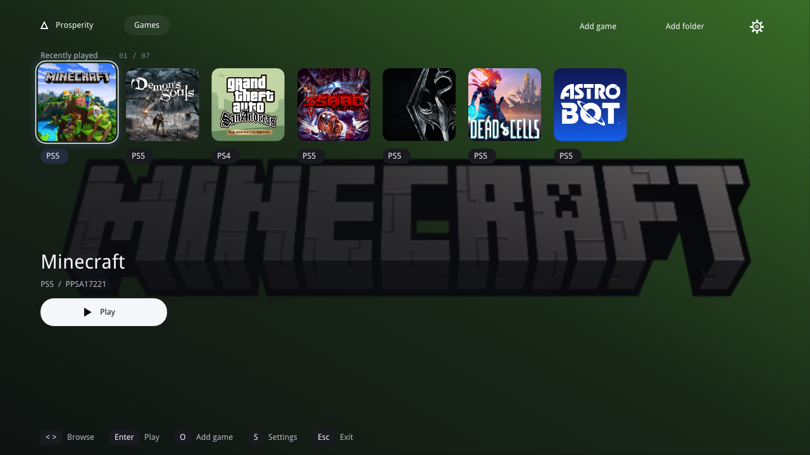
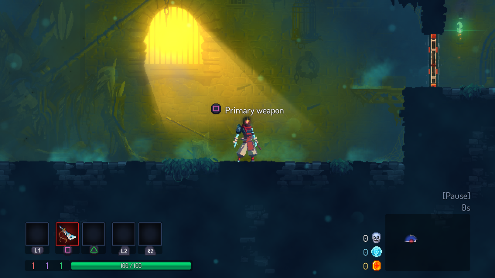
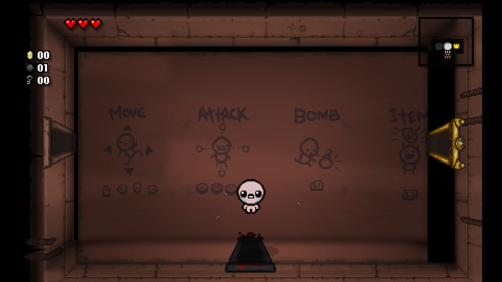
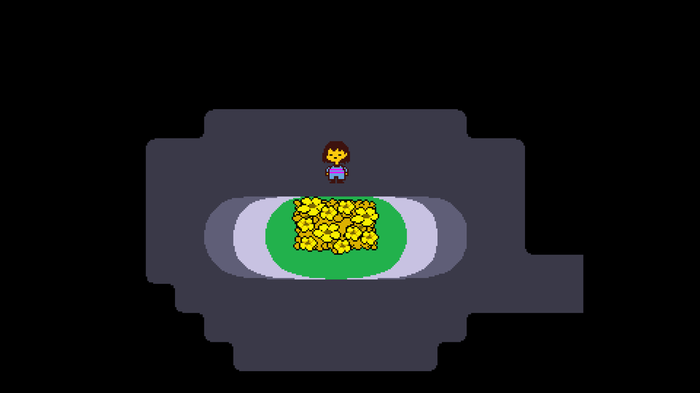
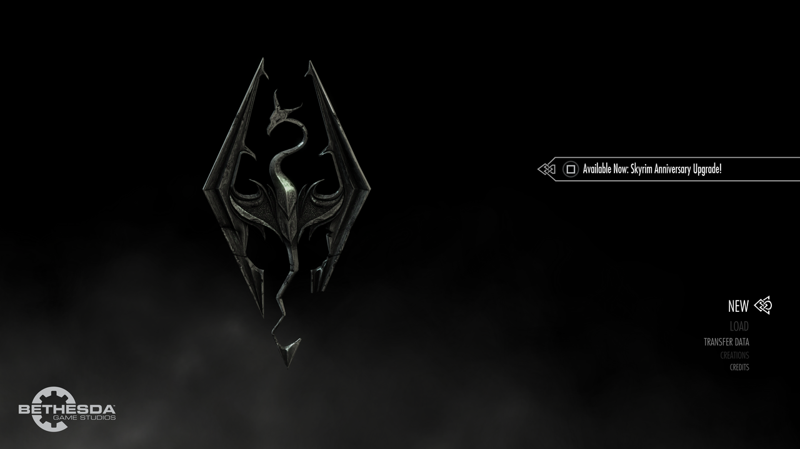
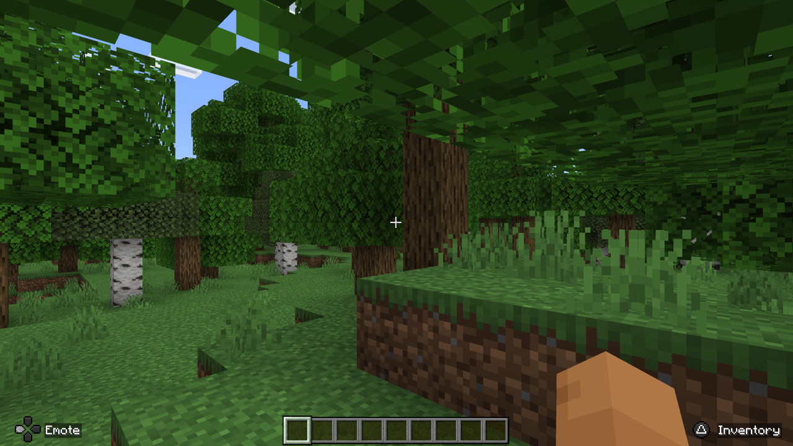
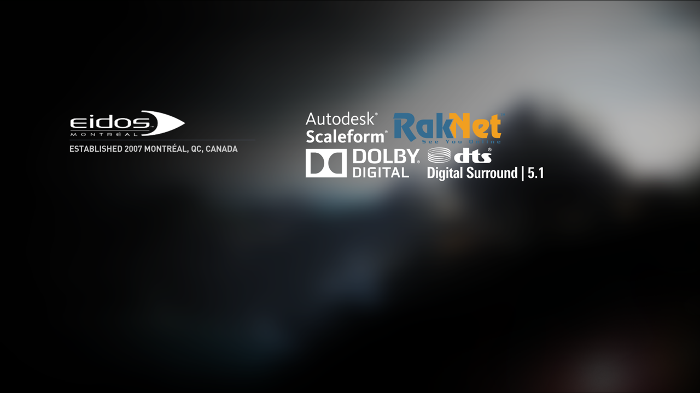
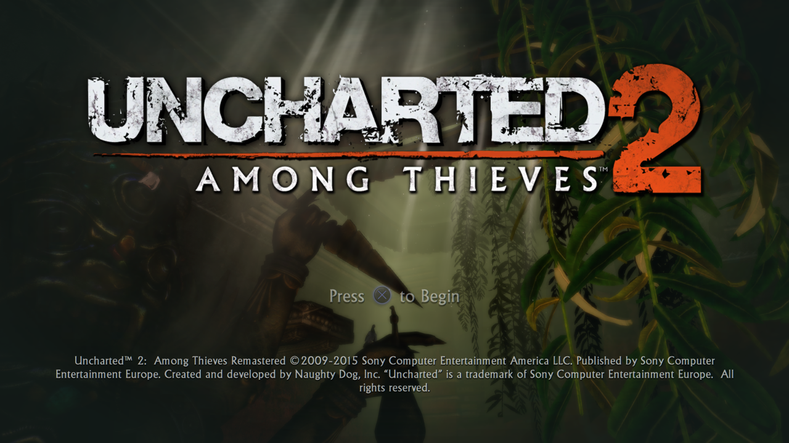
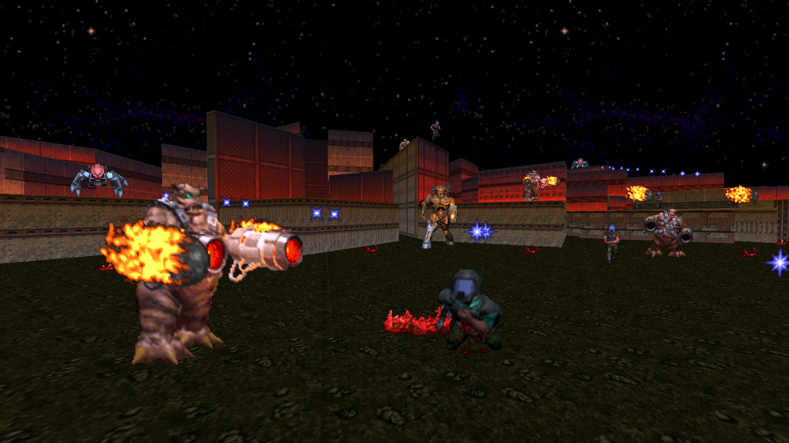

# Prosperity 

Prosperity (formerly known as PS4Delta) is a PS4 and PS5 emulator for Linux and Android.

Join the community on [Discord](https://discord.gg/3FKUEk2FWP).

## Platform support

| Platform | Tier | Status |
| --- | --- | --- |
| Linux (AMD64) | 1 | Works well |
| Linux (ARM64) | 2 | Supported |
| Android | 2 | Supported |
| Windows | 3 | Planned, community help welcome |

CPU code runs directly on AMD64 or through FEX on ARM64. PS4/PS5 graphics are translated to SPIR-V and recompiled for your GPU.

## Showcase



|  |  |  |
|:------------:|:------------:|:------------:|
| <br>**Dead Cells (PS5)**<br>Gameplay in the Prisoners’ Quarters | <br>**The Binding of Isaac: Repentance (PS5)**<br>Gameplay | <br>**Undertale (PS4)**<br>Gameplay |
| <br>**Skyrim (PS5)**<br>Main menu | <br>**GTA: San Andreas (PS4)**<br>Main menu | <br>**Minecraft (PS5)**<br>Gameplay |
| <br>**Tomb Raider: Definitive Edition (PS4)**<br>Startup screen | <br>**Uncharted 2 Remastered (PS4)**<br>Title screen | <br>**DOOM 64 (PS4)**<br>Gameplay demo |

## Documentation
* [Building](docs/building.md)
* [Installation & running](docs/installation.md)
* [Code conventions](docs/conventions.md)

## Quick start (Linux)

```bash
git clone --recursive https://github.com/Force67/prosperity.git
cd prosperity
nix develop
cmake -S . -B build -G Ninja -DCMAKE_BUILD_TYPE=Release
cmake --build build
./build/delta/main/ps4delta --configure-ps4-fw /path/to/ps4-decrypted-modules
./build/delta/main/ps4delta /path/to/game.pkg
```

Requires [Nix](https://nixos.org/download) to preserve my sanity as the developer,
with flakes enabled and your own console dumps. See [building](docs/building.md)
for other build targets and [installation & running](docs/installation.md) for PS5 modules,
TTY use, and CLI options.

## Requirements

### On Linux
* __Processor__: x86-64 (made in the last 10 years) with AVX, SSE4.2 and BMI1, or an aarch64 host.
* __RAM__: 16 GB of RAM.
* __Graphics__: A GPU with support for Vulkan 1.4+ and a minimum of 8 GB of VRAM (the more, the better).

### On Android
* __Processor__: Preferably something new, like one of those fancy new Snapdragons.
* __RAM__: 12 GB of RAM (8 GB may work, depending on the type of game you want to run).
* __Graphics__: A GPU with support for Vulkan 1.4+.

## Thanks and credits
- zecoaxco
- anon (You know who you are)
- GPCS4
- idc/uplift (original inspiration for PS4Delta)

## Legal

Prosperity ships no Sony code. You must supply your own decrypted system modules
and games, dumped from hardware you own. See
[docs/installation.md](docs/installation.md).
